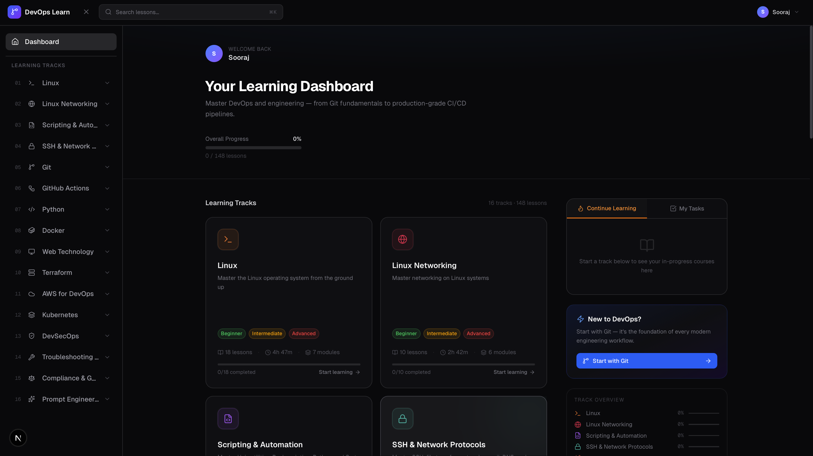
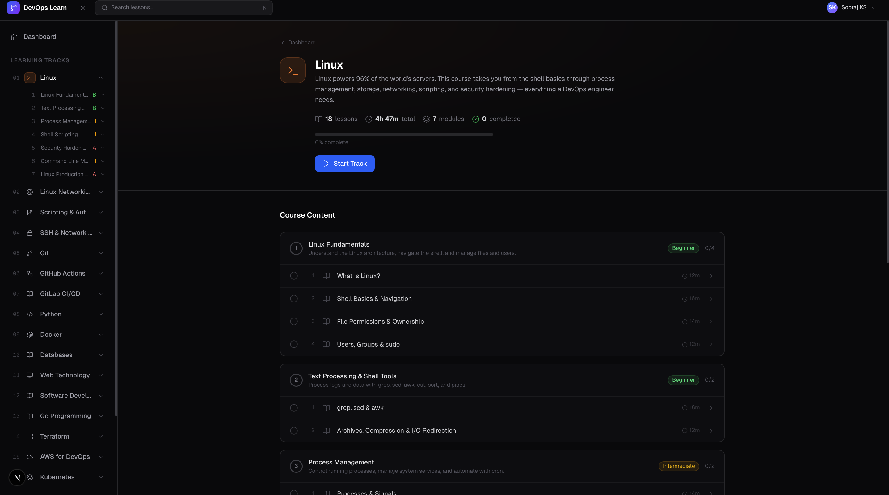
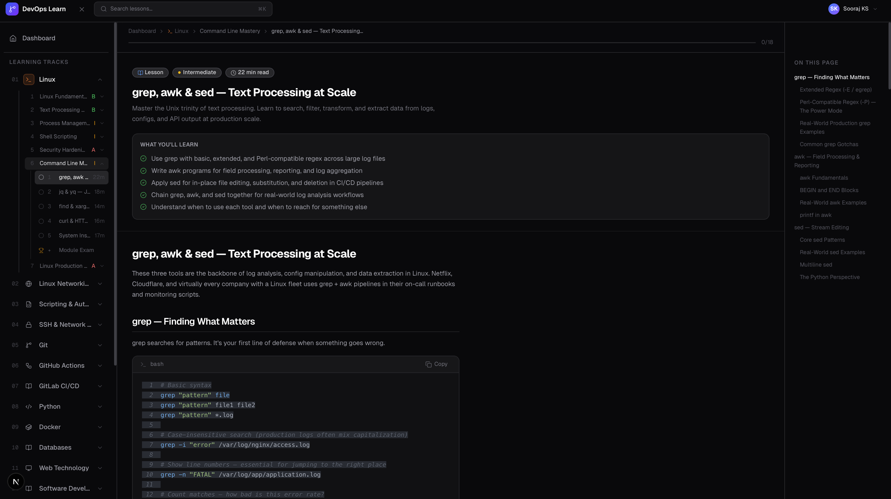

# DevOps Learn

A self-paced DevOps learning platform with 20 tracks covering Linux, cloud, containers, CI/CD, security, and more. Everything runs locally in the browser with no backend required.

---

## Features

- **20 learning tracks** organized from beginner to advanced, with modules and individual lessons
- **Progress tracking**: Lesson completion state is saved automatically in your browser profile
- **Profile system**: Support for multiple learner profiles, each with independent progress tracking
- **Module exams**: Quiz-style assessments to test your knowledge at the end of each module
- **Notes**: Ability to attach personal study notes to any lesson
- **Full-text search**: Instant search across all 20 tracks, modules, and lessons
- **Light / Dark mode**: Easy theme toggling from the top navigation bar
- **Lesson navigation**: Previous/next links within a track and breadcrumb navigation
- **No backend required**: All data is saved locally using browser localStorage

---

## Learning Tracks

| # | Track | Level | Topics |
|---|-------|-------|--------|
| 01 | **Linux** | Beginner → Advanced | File system, permissions, process management, shell scripting, security hardening |
| 02 | **Linux Networking** | Beginner → Advanced | TCP/IP, DNS, firewalls, network troubleshooting, VPNs |
| 03 | **Scripting & Automation** | Beginner → Intermediate | Bash scripting, cron, automation patterns |
| 04 | **SSH & Network Protocols** | Beginner → Intermediate | SSH keys, tunneling, port forwarding, SCP/SFTP |
| 05 | **Git** | Beginner → Advanced | Branching, merging, rebasing, hooks, workflows |
| 06 | **GitHub Actions** | Beginner → Advanced | Workflows, runners, secrets, matrix builds, reusable workflows |
| 07 | **GitLab CI/CD** | Beginner → Advanced | Pipelines, runners, templates, environments, Container Registry, security scanning |
| 08 | **Python** | Beginner → Advanced | Core Python, scripting, automation, APIs, testing |
| 09 | **Docker** | Beginner → Advanced | Images, containers, volumes, networking, Docker Compose, security |
| 10 | **Databases** | Beginner → Intermediate | SQL, PostgreSQL, Redis, backups, connection pooling |
| 11 | **Web Technology** | Beginner → Intermediate | HTTP, TLS, reverse proxies, load balancing, CDNs |
| 12 | **SDLC** | Beginner → Intermediate | Agile, Scrum, Kanban, release management, SLOs |
| 13 | **Go Programming** | Beginner → Intermediate | Go fundamentals, concurrency, CLI tools, Docker/Kubernetes SDKs |
| 14 | **Terraform** | Beginner → Advanced | HCL, providers, modules, workspaces, remote state, advanced patterns |
| 15 | **AWS** | Beginner → Advanced | EC2, S3, VPC, IAM, RDS, EKS, Lambda, CloudFormation |
| 16 | **Kubernetes** | Intermediate → Advanced | Pods, deployments, services, ingress, RBAC, Helm, operators |
| 17 | **DevSecOps** | Intermediate → Advanced | Threat modeling, SAST/DAST, secret scanning, supply chain security |
| 18 | **Troubleshooting** | Intermediate → Advanced | Systematic debugging, observability, incident response, postmortems |
| 19 | **Compliance** | Intermediate → Advanced | SOC 2, ISO 27001, GDPR, audit trails, policy as code |
| 20 | **Prompt Engineering** | Beginner → Advanced | LLM fundamentals, prompt patterns, AI-assisted DevOps workflows |

---

## Screenshots

### Dashboard


### Track Page


### Lesson Viewer


---

## Running Locally

### What you need first

Before you start, make sure you have the following installed on your computer:

- **Node.js v18 or higher**: Download from [nodejs.org](https://nodejs.org) (LTS version is recommended)
  - To check if you already have it: open a terminal and run `node -v`
- **Git**: Download from [git-scm.com](https://git-scm.com)
  - To check if you already have it: run `git --version`

### Step-by-step setup

**1. Clone the repository**

This downloads the project code to your computer.

```bash
git clone https://github.com/<your-username>/devops-lms.git
```

**2. Enter the project folder**

```bash
cd devops-lms
```

**3. Install dependencies**

This installs all the libraries the project needs. It may take a minute.

```bash
npm install
```

**4. Start the development server**

```bash
npm run dev
```

**5. Open the app**

Open your browser and go to: [http://localhost:3000](http://localhost:3000)

You'll be asked to create a learner profile on first launch. Enter any name and click **Get Started**.

> **Tip:** The development server supports hot reloading. Any changes you make to the code will appear in the browser instantly without restarting the server.

---

## Running with Docker

Docker lets you run the app in a container without installing Node.js. This is the recommended way to run it in production.

### What you need

- **Docker Desktop**: Download from [docker.com](https://www.docker.com/products/docker-desktop) and ensure it is running

### Option 1: Pull the pre-built image from GitHub Container Registry

If the project has been pushed to GitHub, you can pull the ready-made image directly:

```bash
docker pull ghcr.io/<github-username>/<repo-name>:latest
docker run -p 3000:3000 ghcr.io/<github-username>/<repo-name>:latest
```

Then open [http://localhost:3000](http://localhost:3000).

### Option 2: Build the image yourself

If you've cloned the repository and want to build locally:

```bash
# Build the image (this takes a few minutes the first time)
docker build -t devops-lms .

# Run the container
docker run -p 3000:3000 devops-lms
```

Then open [http://localhost:3000](http://localhost:3000).

To stop the container, press `Ctrl + C` in the terminal.

### Run in the background (detached mode)

If you want the container to keep running after you close the terminal:

```bash
docker run -d -p 3000:3000 --name devops-lms devops-lms
```

To stop it later:

```bash
docker stop devops-lms
```

---

## Building using Docker Compose (Self Hosting)
## Docker Compose

```bash
docker compose up -d
```

Example compose file:

```yaml
services:
  improving-everyday:
    image: ghcr.io/sooraj-sky/improving-everyday:latest
    container_name: devops-local-book

    ports:
      - "3000:3000"

    environment:
      NODE_ENV: production
      PORT: 3000
      HOSTNAME: 0.0.0.0

    restart: unless-stopped
```

## Building for Production (without Docker)

If you want to run the optimised production build directly with Node.js:

```bash
# Build the app
npm run build

# Start the production server
npm start
```

The app will be available at [http://localhost:3000](http://localhost:3000). The production build is faster and uses less memory than the development server.

---

## Tech Stack

| Technology | Purpose |
|-----------|---------|
| [Next.js](https://nextjs.org) | React framework (App Router) |
| TypeScript | Type-safe JavaScript |
| Tailwind CSS | Styling |
| localStorage | Client-side data storage (no external database required) |
| React Context | State management for profiles and progress |
| Lucide React | Icons |

---

## Project Structure

```
devops-lms/
├── app/                  # Pages and routes (Next.js App Router)
├── components/
│   ├── layout/           # Sidebar, top nav, app shell
│   ├── lesson/           # Lesson viewer, code blocks, quizzes
│   └── ui/               # Reusable UI primitives (buttons, dialogs, etc.)
├── lib/
│   ├── content/          # All 20 learning tracks as TypeScript files
│   └── hooks/            # React hooks (useProfile, useProgress, useNotes, useTheme)
└── public/               # Static assets and screenshots
```

---

## Adding a New Track

Each learning track is a single TypeScript file. To add your own:

1. Create `lib/content/my-topic.ts` by copying the structure of an existing track, such as `lib/content/linux.ts`
2. Import and add it to the `tracks` array in `lib/content/index.ts`
3. Add a gradient colour class for the track card in `app/globals.css`

---

## Troubleshooting

**`npm install` fails**
Make sure you have Node.js v18 or higher. Run `node -v` to check. If the version is lower, download the latest LTS from [nodejs.org](https://nodejs.org).

**Port 3000 is already in use**
Another app is using port 3000. Either stop that app, or run the dev server on a different port:
```bash
npm run dev -- -p 3001
```
Then open [http://localhost:3001](http://localhost:3001).

**Docker build fails with "Cannot connect to the Docker daemon"**
Docker Desktop is not running. Open it from your Applications folder (Mac) or Start menu (Windows) and wait for it to fully start before running the build command again.

**Changes I make to the code don't appear**
Make sure the development server (`npm run dev`) is running. If it is, try refreshing the browser. If the issue persists, stop the server with `Ctrl + C` and start it again.
